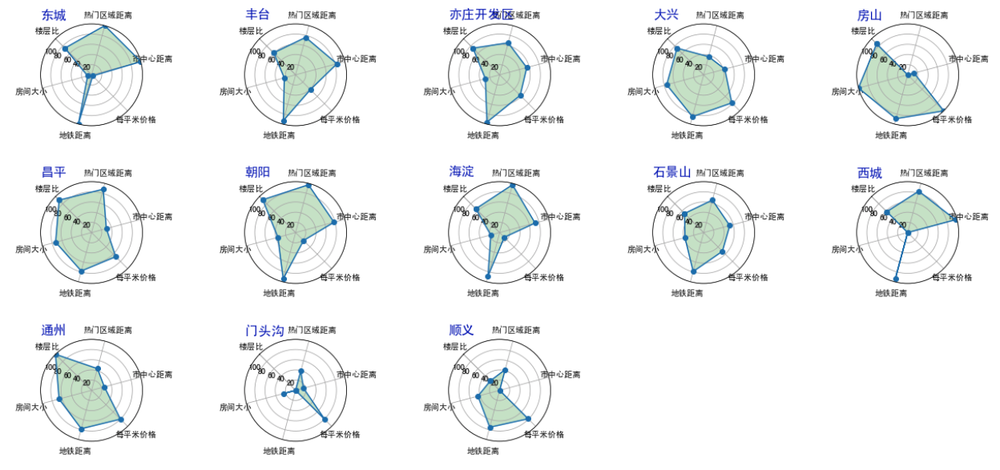

## 项目说明   
通过采集自如网的房源数据共92789条，统计分析其房源分布，价格分布，并综合六个指标（房间大小、楼层比、地铁最短距离、每平米价格，离市中心平均距离，离最近的热点区域(国贸、望京、中关村、西二旗)的距离）对每个区域的合租和整租的房源进行评价。  

数据地址：`insight/ziru_house.txt`
分析代码：`insight/insight_ziru.ipynb`  
地图可视化： `map/`

### 房源6维指标评价
1、合租   
  
2、整租  
  

### 房源分布  
 
